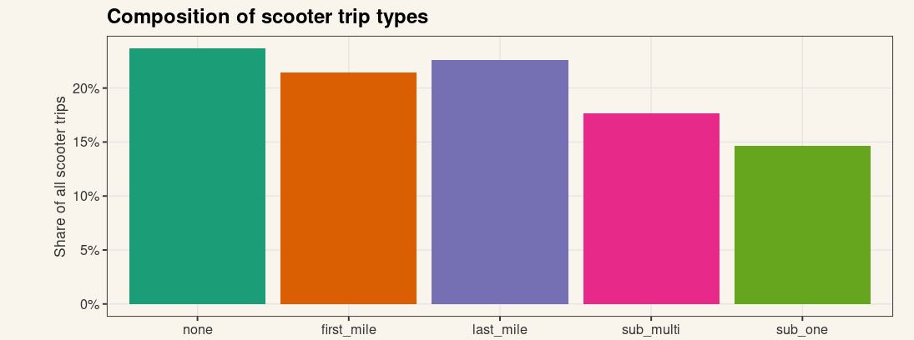
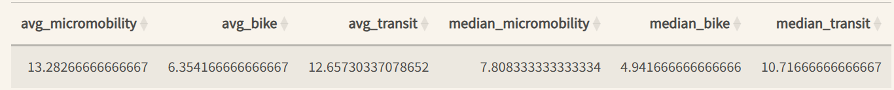
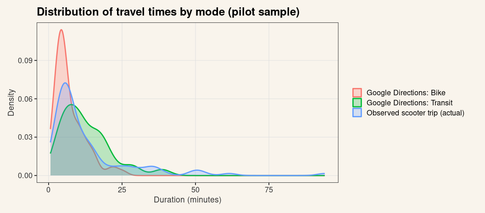
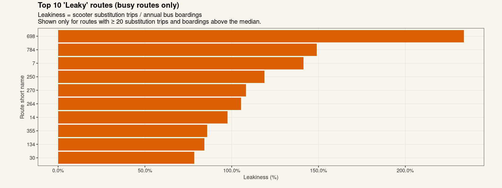
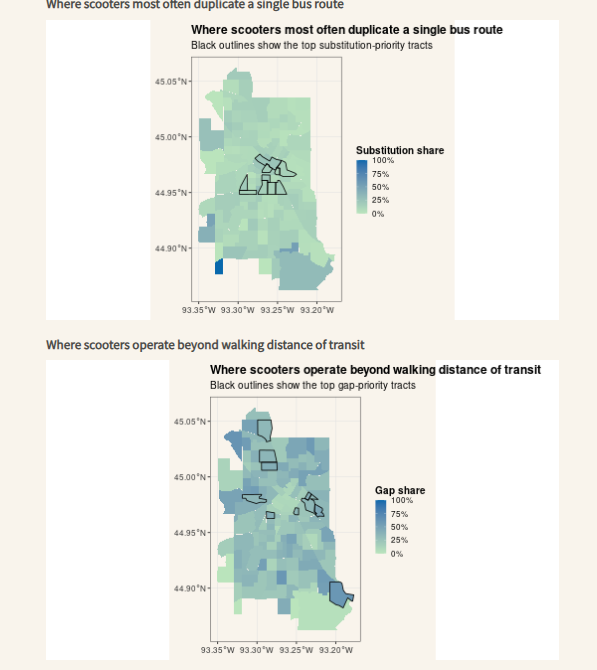

# Projects in Data Science: A Crossover of Micromobility and Public Transportation in Minneapolis
```{r}
library(knitr)
```
*Aki Wada, Hanna Chang, and Yosephine Manihuruk*

## Project Summary

## Research Question

> How can we identify redundant/unique segments in public transit routes and micro mobility data in Minneapolis, and how can we use the observations to optimize inter-Minneapolis travel?

**Motivation**

Our project stemmed from our shared interest in spacial data analysis, one of its specific trait being its versatility. After trying different datasets of spacial data, we realized quite quickly that trying to do international data would be quite difficult as different countries have different systems of storing data and that data would more likely be behind a paywall. We narrowed our scope to Minneapolis due to its openness of its transportation data. While looking though that data we discovered that they tracked the usage of e-bike and e-scooters such as lime which is relatively new to the Minneapolis transportation. Comparing a new form of transportation to the usage of the older more structured form could bring us more insight into the efficacy of the lime scooter and what gaps our current public transportation has for the general populace.

With the rise of urbanization, cities are facing increasing challenges in managing transportation systems efficiently. Redundant routes can lead to wasted resources, increased traffic congestion, and higher emissions. By identifying and optimizing these routes, we can improve the overall efficiency of public transit and micro mobility options in Minneapolis, making it easier for residents to navigate the city while reducing environmental impact.

## Data

For this project we used data from both sources that we found online and sources that we got from in-person meetings.

Our first source we got came from the Open Minneapolis website. This website shares all the city data form Minneapolis to the general public. This website has everything from bus routes to 3-11 calls to an e-scooter dashboard. The problem with this data that it is not very good. It has the data of the of the beginning point, end points, and time. This would have been a dead end if we did not contact Max Gonzalez who was able to help us query better data. We were able to get all the data in 2025 on e-scooter in regards to their start point, end point, ride duration, ride distances, date and ride times.

The second data source that we are using is the GTFS data. GTFS (or General Transit Feed Specification) is an open source documentation platform for international transit schedules and routes. Although this has good data on all the transit(stop locations, schedules, routes, etc) they were all in separate text files that needed to be cleaned and joined.

The 3rd data source we are using is the Google API. this API allows us to use Google maps data to see the most efficient routes to go to any place on the map separated by the mode of transportation (bikes, public transit, cars). We can use this API to track if the usage of micromobility is actually a better form of transit than any of the other public transit method.


## Analysis

The spatial distribution of micromobility trip-starts across Minneapolis reveals a highly clustered pattern centered around the city’s urban core, with density diminishing progressively toward peripheral neighborhoods. The highest-intensity cells, representing between 1,600 and over 6,000 trip starts per week, are concentrated in and around Downtown Minneapolis, the University of Minnesota area, and the Uptown/Lyn-Lake corridor. These zones represent areas with high population density, commercial activity, and strong transit connectivity, suggesting that micromobility usage is most heavily driven by demand for short, urban trips that complement existing transportation infrastructure.

Trip density also appears to align with major transit lines and corridors. The presence of consistently moderate-to-high density cells along Hennepin Avenue, University Avenue, Lake Street, and Portland–Park suggests that micromobility trips function as a first-mile/last-mile link to public transit. This is consistent with known behavior in cities where shared bikes and scooters support multimodal movement patterns. Outlying residential neighborhoods such as Nokomis, Camden, or parts of Northeast show sparse usage, reflecting lower trip demand, reduced station/service availability, or longer trip distances less suited for micromobility.


Interestingly enough the e-scooter usage seems to be filling in more gaps in the transportation than we expected. over 60% of e-scooter users are not overlapping inside the bus routes. In fact the majority of trips do not have any overlap with bus stops what so ever. We expected that most e-scooter rides would be utilizes as the first or last mile of a trip; meaning that e-scooters would be used to get to bus stops instead of replace them. Although there is a large portion of data that does support that people are using the e-scooters for this reason, there is still a large portion of the data supports that people are using e-scooters in places where bus routes are not in easily accessible locations. This implies that there are places where there would be an effective for Minneapolis to fill in these gaps of bus routes.




In terms of efficiency of travel, the e-scooters have proven themselves to be a little inefficient. The e-scooters median time is about 7 minutes, They seem to be doubling the median time of bikes at about 4 minutes and to be slightly below transit times at around 10 minutes. We are using median times instead of average time due to the high amount of outliers present in the scooter data. This is most likely due to the fact that people also use e-scooters for leisure instead of effective transportation.



Looking at the density usage of bikes, micromobility, and transit, we can see there is a correlated usage between micromobility and transit that is no there for bikes. We can see that bike usage is more typically used for shorter trips than that of both transit and micromobility. although micromobility is used for shorter trips than that of transit, its modal distribution is similar to that of transit which could imply that transit and micromobility are used for similar circumstances that separate them from bike usage.



Notably, there are bus routes that are seen as less optimal to use than micromobility. In order to track transit routes that are being used less than what people are using e-scooters for we made a measure of leakiness. This measures the amount of ridership on these bus routes divided by how many trips people took on the e-scooters(removing all bus routes that do not get high ridership such as express buses). We get seven bus routes that people prefer using scooters over the traditional methods; Bus route 698 getting over 200% more people using scooters than using that route. This implies there is some flaws with these routes that should be addressed by the Minneapolis Department of Transportation



Mapping out which neighborhoods are interacting most meaningfully with micrombility had some interesting discoveries.Most places in Minneapolis only have less than a 20% replacement rate of transit routes by e-scooters. We can infer from this that most people perfer using the public transit than that of scooters. This makes sense as scooters are often a less comfortable riding experience than public transit due to the lack of luggage space and being more out in the open. Even when we see the substitution priority tracks, they seem to be relatively standardized to the rest of the maping. When we look at the mapping of where scooter are operating outsides the bounds of the transit system, we see a lot more people falling through the gaps of the transit system. Although most neighborhoods are below 50%, it is quite a starck difference than what is to be expected of our transit routes. This implies that there is a lot of room for MnDot to improve their transit system in these neighborhoods.



Overall, we can see that micromobility is filling in gaps in our public transit more throughly than previously examined. Most people are using micromobility in areas that lack a walkable transit stop, opting to use them as intermediaries to get to transit stops or opting to bypass these stops all together. This could be fine for the general populace if it took into account effiecency of transportation as e-scooters are on median faster than transit usage, transit usage will always be useful for when riders have bags or when the weather is not optimal for scooter usage. Although they seem to be the most popular around mixed-use urban centers and least popular in dispersed residential areas, which are typically the same areas where transit is popular, there seems to be gaps of where these in these enviornments where e-scooter are findingtheir niche. These findings support the idea that micromobility is being used as not a substitue for public transit, but a form a transportation that is filling in gaps within our public transit that we should adress.

## Method Evaluation & Limitations

While this project has brought in some interesting insights to how micrmobility interacts with the rest of our transportation systems, there are still some limitations in our work.

One such limitations is our inability to track e-scooter trips. Although we are able to get the points where the trips starts and ends, we are unable to get the routes of the scooter for security reasons. This means that we are forced to assume the riders are taking the most efficient and safest route to get from point A to point B. simply looking at the amount of outliers, we can see that this is not the case. People use scooters for all kinds of activities that are not tracked, for instance dropping someone off or going on a joy ride will have vastly different implications to our visualizations.

Our project's usage of what is considered walkable distance from a stop can be considered faulty. We decided to use a 30 meter radius around the centerlines to determine walk able distance. If we were to increase this radius around the centerlines we might get different data on how we measure the different behavior types. We think that our findings of having majority bike trips that are not near any bus routes to be unlikely from our own persona experience and what our density map says, so in future explorations of our data we would increase the size of the "walkable area".

The choice of grid size strongly shapes the apparent concentration of trips. Smaller grids give more localized detail but can exaggerate noise, while larger grids smooth transitions and may mask meaningful micro-spatial patterns. Although the selected grid seems to balance clarity with granularity, results should be contextualized in relation to this design choice.

Density values represent raw counts rather than normalized rates. High-density zones may reflect not only true user demand but also differences in device availability, operator service priorities, or the permitted riding zones defined by vendors. Areas with low or missing values may not indicate lack of demand but rather policy-based or supply-based restrictions (e.g., geofencing, maintenance gaps, or availability biases). Without incorporating supply-side metrics, the map reflects observed usage rather than potential or unmet demand.

Although there can be many changes we can apply to our data as we assumed what would be considered readable for our density map, what is considered an optimal route for our micromobility data, and what is considered walkable with out transit data we think that our current assumptions generally match what we believe to be a good visualizations of how micromobility interacts with our transit system. If we were to ever revist this project it would be imperative that we see what would happen if we change these factors and what that result would mean for our current analysis.

## Member Contributions

Aki - Worked with preliminary data and exploratory vizualizations. made the Final Narrative. Communicated and got in contact with the experts

Yosephine - Created the Dashboard. Cleaned all the GTFS and Mircomobility Data. Took notes on the experts contributions.

Hanna - Worked with the google API. added much needed versatility to our vizualizations. Set up meeting with the experts

## AI Statement
