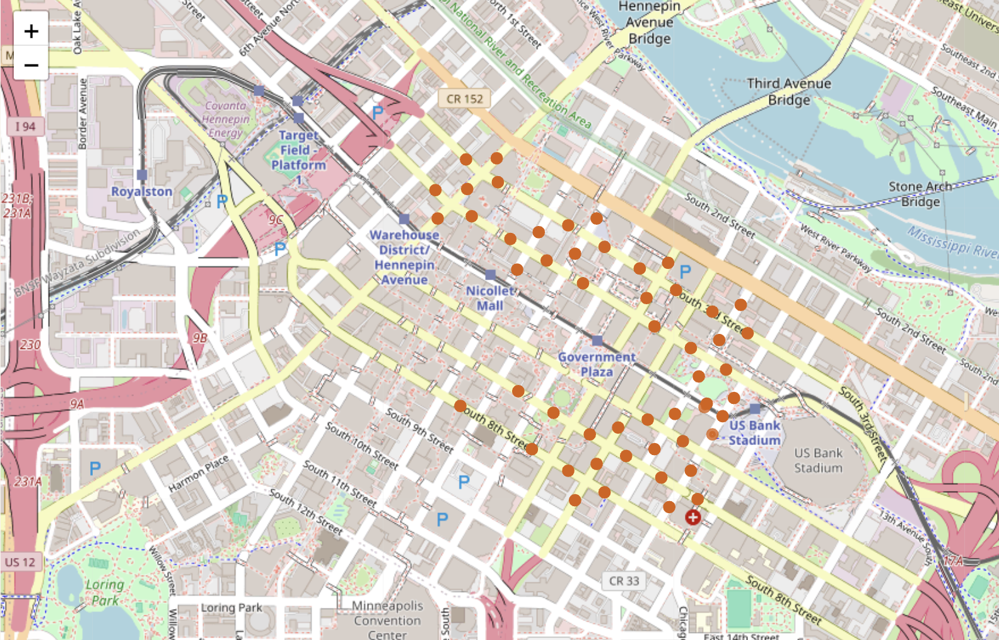
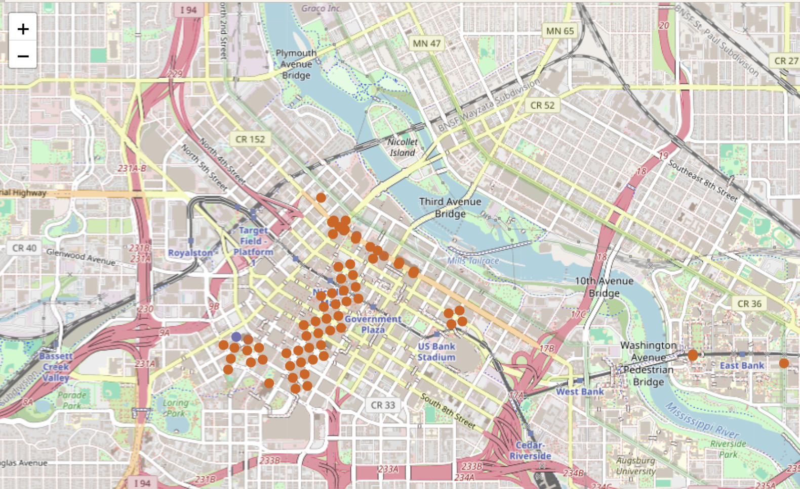
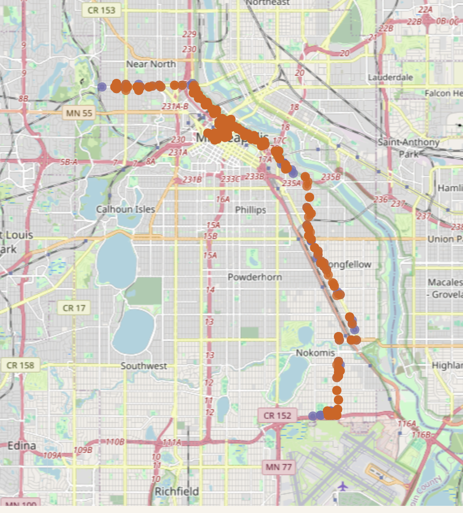
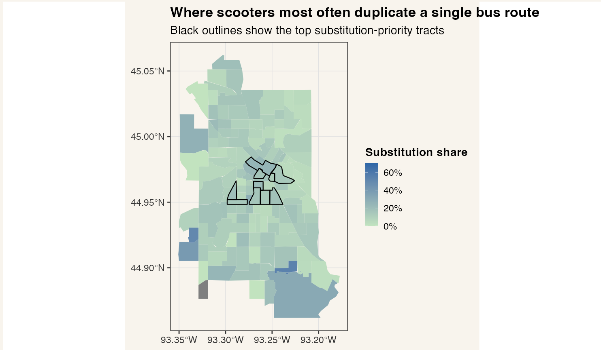
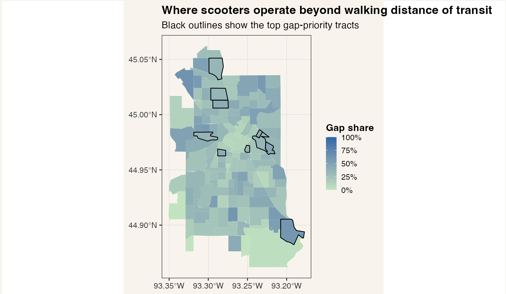

# Projects in Data Science: A Crossover of Micromobility and Public Transportation in Minneapolis

```{r}
library(knitr)
```

*Aki Wada, Hanna Chang, and Yosephine Manihuruk*

## Project Summary

## Research Question

> How can we identify where micromobility (e-scooters) **connects to** public transit versus where it **substitutes for** transit - or fills **access gaps** - in Minneapolis, and how can these observations inform transit and mobility planning?

**Motivation**

Our project stemmed from our shared interest in spatial data analysis, one of its specific trait being its versatility. After trying different datasets of spatial data, we realized quite quickly that trying to do international data would be quite difficult as different countries have different systems of storing data and that data would more likely be behind a paywall. We narrowed our scope to Minneapolis due to its openness of its transportation data. While looking through that data, we discovered that they tracked the usage of e-bike and e-scooters such as lime which is relatively new to the Minneapolis transportation. Comparing a new form of transportation to the usage of the older more structured form could bring us more insight into the efficacy of the lime scooter and what gaps our current public transportation has for the general populace. Are scooters primarily a *first-mile/last-mile bridge* to transit? Are they replacing certain bus trips? Or are they serving areas where transit access is weak?

With the rise of urbanization, cities are facing increasing challenges in managing transportation systems efficiently. Redundant routes can lead to wasted resources, increased traffic congestion, and higher emissions. By identifying and optimizing these routes, we can improve the overall efficiency of public transit and micro mobility options in Minneapolis, making it easier for residents to navigate the city while reducing environmental impact. Our goal was to produce a dashboard that makes these patterns visible and usable.

## Data

For this project we used data from both sources that we found online and sources that we got from in-person meetings.

Our first source we got came from the Open Minneapolis website. This website shares all the city data form Minneapolis to the general public. This website has everything from bus routes to 3-11 calls to an e-scooter dashboard. The problem with this data that it is not very good. It has the data of the of the beginning point, end points, and time. This would have been a dead end if we did not contact Max Gonzalez who was able to help us query better data. We were able to get all the data in 2025 on e-scooter in regards to their start point, end point, ride duration, ride distances, date and ride times.

The second data source that we are using is the GTFS data. GTFS (or General Transit Feed Specification) is an open source documentation platform for international transit schedules and routes. Although this has good data on all the transit(stop locations, schedules, routes, etc) they were all in separate text files that needed to be cleaned and joined.

The third data source we are using is the Google API. this API allows us to use Google maps data to see the most efficient routes to go to any place on the map separated by the mode of transportation (bikes, public transit, cars). We can use this API to track if the usage of micromobility is actually a better form of transit than any of the other public transit method.

## Analysis

**Link to our Dashboard: <https://yospepin.shinyapps.io/Dashboard/>**

#### 1) Behavior types: how scooters relate to transit

Because scooter trips are recorded as anonymized street segments, we classified trips based on whether their **start and/or end segments** are “near transit.” We operationalized “near transit” as being within **30 meters** of a transit stop (using buffered street geometry and nearest-stop distance checks). Using this, we categorized each trip into five behavior types:

-   **none**: neither start nor end is near a transit stop (interpreted as potential *access gaps*)

-   **first_mile**: trip ends near a stop (interpreted as traveling *into* transit)

-   **last_mile**: trip starts near a stop (interpreted as traveling *out of* transit)

-   **sub_one**: both ends are near stops served by the *same bus route* (strongest substitution candidate)

-   **sub_multi**: both ends are near stops, but require multiple routes/transfers (broader substitution candidate)

    One of the most striking results was how frequently scooters appear to operate **outside** the walkable transit network under our proximity definition: **a majority of trips fall into the “none” category**, meaning neither end of the trip is within the near-stop threshold. While we expected scooters to be classified mostly as **substitution**, the results suggest scooters are also heavily used where transit stops are not easily accessible (or where the segment-based data makes stops appear further away than they truly are).

    {fig-align="center" width="749"}

#### 2) Time-of-day patterns: commuting vs leisure vs consistent mixes

We analyzed hourly scooter activity separately for weekdays and weekends. Total trip volumes change dramatically throughout the day, but the *mix* of behavior types is comparatively stable, suggesting that scooters play multiple roles consistently, not just at commute peaks. Still, we observed meaningful commuter signals: early morning increases in first-mile behavior and afternoon increases in last-mile behavior, consistent with scooters supporting transit-linked travel in commute windows.

#### 3) Distance to stops: segment-centroid measurement constraints

We computed distance-to-nearest-stop using the centroid of the anonymized start segment. Distances cluster near the lower end for transit-integrated behaviors, which supports the validity of the classification logic. For "none" trips, we also observed a lot of upper-end outliers, which indicates many of these trips operates very far from nearest bus stops. However, because street segments can be long, a centroid-based distance can overstate how far a rider actually was from a stop, especially on long residential blocks.

#### 4) Route “leakiness”: where scooters may be substituting for buses

To identify routes where scooters may be competing most strongly with transit, we created a “leakiness” metric:

**leakiness = (scooter substitution trips on route) / (annual boardings on route)**

To keep the metric interpretable, we restricted analysis to busier routes (above a boardings threshold) and required a minimum number of substitution trips per route. This avoids extreme ratios driven by low-ridership express routes or sparse service.

Our results highlight a small set of routes with unusually high substitution intensity, suggesting corridors where riders may be opting for scooters over buses. This does not prove scooters are causing ridership loss, but it provides a shortlist of routes that could benefit from closer evaluation (e.g., reliability, wait time, last-mile connectivity, speed, or comfort).

Here are the maps of sub_one trips along bus route 698, 784 and 7. These routes can be examined using our "Substitution Explorer" Tab. These are the top 3 "leaky" bus routes according to our metrics. You can see how the 698 and 784 mostly are in downtown Minneapolis, while route 7 covers a bigger area.

{fig-align="center" width="303"}

{fig-align="center" width="307"}

{fig-align="center" width="304"}

#### 5) Neighborhood patterns: substitution vs access gaps

We mapped tract-level outcomes to see where scooter–transit interactions concentrate:

-   **Substitution share (sub_one share):** where scooters most often replicate a single bus route

    {width="501"}

-   **Gap share (none share):** where scooters operate beyond the near-stop threshold
    {width="499"}

Most tracts show relatively modest substitution shares, suggesting that in many neighborhoods, scooters are not simply replacing transit. In contrast, gap shares are more pronounced in several areas, indicating neighborhoods where scooters may be functioning as a workaround for weak transit access or where the 30m segment-based definition undercounts stop proximity. We also created priority scores to identify tracts where interventions could have the greatest impact, with an explicitly equity-focused scoring model for access gaps (weighting gap share and lower income more heavily, while also considering zero-car share, boardings density, and population).

#### 6) Travel time benchmarking

Using a pilot sample of OD pairs, we compared observed scooter durations to Google-estimated bike and transit durations. In the pilot sample, scooter trips are often faster than modeled transit trips but slower than modeled bike trips in median terms. We used medians (not means) due to outliers. Many scooter trips likely include leisure riding, waiting, or detours not captured by “efficient-route” assumptions. This section is best interpreted as a **benchmark**, not a definitive ranking of modes.

In terms of efficiency of travel, the e-scooters have proven themselves to be a little inefficient. The e-scooters median time is about 7 minutes, They seem to be doubling the median time of bikes at about 4 minutes and to be slightly below transit times at around 10 minutes. We are using median times instead of average time due to the high amount of outliers present in the scooter data. This is most likely due to the fact that people also use e-scooters for leisure instead of effective transportation.

{fig-align="center" width="618"}

Looking at the density usage of bikes, micromobility, and transit, we can see there is a correlated usage between micromobility and transit that is no there for bikes. We can see that bike usage is more typically used for shorter trips than that of both transit and micromobility. Although micromobility is used for shorter trips than that of transit, its modal distribution is similar to that of transit which could imply that transit and micromobility are used for similar circumstances that separate them from bike usage.

{fig-align="center" width="669"}

Overall, we can see that micromobility is filling in gaps in our public transit more throughly than previously examined. Most people are using micromobility in areas that lack a walkable transit stop, opting to use them as intermediaries to get to transit stops or opting to bypass these stops all together. This could be fine for the general populace if it took into account effiecency of transportation as e-scooters are on median faster than transit usage, transit usage will always be useful for when riders have bags or when the weather is not optimal for scooter usage. Although they seem to be the most popular around mixed-use urban centers and least popular in dispersed residential areas, which are typically the same areas where transit is popular, there seems to be gaps of where these in these enviornments where e-scooter are findingtheir niche. These findings support the idea that micromobility is being used as not a substitue for public transit, but a form a transportation that is filling in gaps within our public transit that we should adress.

## Method Evaluation & Limitations

While this project has brought in some interesting insights to how micromobility interacts with the rest of our transportation systems, there are still some limitations in our work.

One such limitations is our inability to track e-scooter trips. Although we are able to get the points where the trips starts and ends, we are unable to get the routes of the scooter for security reasons. This means that we are forced to assume the riders are taking the most efficient and safest route to get from point A to point B. simply looking at the amount of outliers, we can see that this is not the case. People use scooters for all kinds of activities that are not tracked, for instance dropping someone off or going on a joy ride will have vastly different implications to our visualizations.

Our project's usage of what is considered walkable distance from a stop can be subject to further analysis. We decided to use a 30 meter radius around the centerlines to determine walk able distance. If we were to increase this radius around the centerlines we might get different data on how we measure the different behavior types. In future explorations, it would be interesting to increase the size of the "walkable area" and ideally incorporate pedestrian network distance rather than straight-line centroid distance.

There is also the limitation of supply-side bias and service-area constraints. Observed scooter density reflects not only demand but also availability, operator deployment priorities, and any geofenced restrictions. Low trip counts in a neighborhood do not necessarily mean low demand. Additionally, GTFS and boarding datasets may not include every stop/service variation with equal completeness, and boarding totals can be influenced by reporting practices. Our leakiness metric is best used as a screening tool, not a causal ridership-loss estimate.

Despite these constraints, the workflow produces a useful comparative lens: where scooters look transit-connected, where they look gap-filling, and which routes/areas warrant deeper planning attention. If we revisit this project, the most important improvements would be (1) threshold sensitivity testing, (2) network-based walking distances, (3) more explicit modeling of scooter supply/availability, and (4) expanded and time-specific travel-time benchmarking.

## Member Contributions

Aki - Worked with preliminary data and exploratory vizualizations. Led communication with experts and coordinated access to improved micromobility data, and drafted/compiled portions of the final narrative based on team findings and discussions. Created the final presentation slide.

Yosephine - Created the full Shiny dashboard (UI, server logic, interactive maps/tables, and narrative structure) and the preprocessing pipeline that generates the dashboard-ready `.rds` datasets. Led the spatial analysis workflow including behavior classification, hourly aggregations, distance-to-stop calculations, tract-level mapping, priority scoring, and the route leakiness computation. Cleaned most GTFS and Micromobility Data. Documented expert meeting notes for analysis.

Hanna - Implemented and validated the Google Directions API workflow, including extracting, structuring, and integrating modeled bike/transit travel-time estimates for comparison against observed scooter durations. Contributed to creating GTFS joins/concatenation steps.

## AI Statement

For this project, AI was frequently used for research, brainstorming, and debugging code. We have reviewed and edited its content, and we take full responsibility for the final submission.
